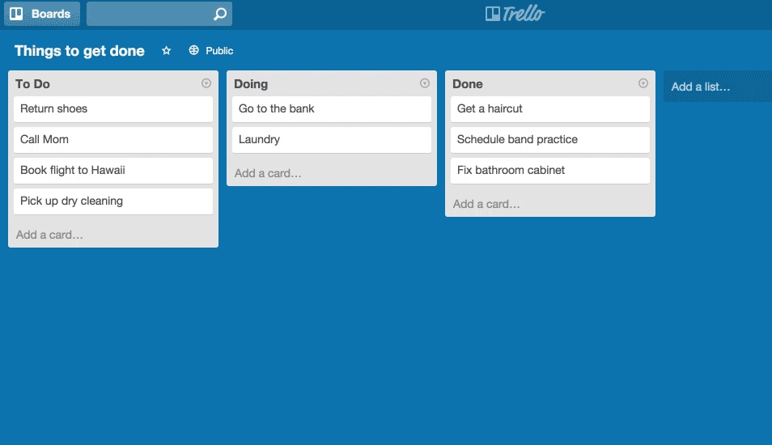

<h2 align="center">Trello Clone</h2>

 

## Wymagana wiedza

- JavaScript, React, CSS

## Technologie potrzebne do zadania

- JavaScript, React, CSS, Redux / Context API

## Cele główne

- [ ] Twoim zadaniem jest odtworzyć stronę z gifa poniżej przy użyciu biblioteki react-beautiful-dnd, oraz Redux bądź Context API.

- [ ] Najważniejsze case'y:

* Twoja aplikacja tworzy listy poprzez kliknięcie w 'Add list...' i podaniu nazwy,
* Karty muszą mieć funkcjonalność przenoszenia do innej listy (pamiętaj o zmianie listy/pozycji danej karty w stanie),
* Stan aplikacji zapisuje się w localStorage,
* Karty mają funkcjonalność zmiany nazwy poprzez kliknięcie w nie.

## Cele dodatkowe

- [ ] Dodaj funkcjonalności:

* Karta posiada możliwość dodania:
  - listy zadań (coś w stylu to-do list), i procent ich wypełnienia - jeśli ma 100% pasek progresu ma jasno zielony kolor
  - terminu wykonania danej karty - dodanie kalendarza (zalecam użycie date-fns)
  - zmiany koloru okładki
  - etykiety

## Przydatne linki

- Strona Trello - https://trello.com/
- Biblioteka react-beautiful-dnd - https://github.com/atlassian/react-beautiful-dnd
- Tutorial do biblioteki react-beautiful-dnd - https://www.youtube.com/watch?v=RI9kA09Egas

