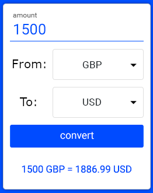
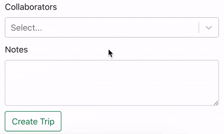

<h2 align="center">Currency Converter</h2>

 

## Wymagana wiedza

- JavaScript, HTML, React

## Technologie potrzebne do zadania

- JavaScript, HTML, React

## Cele główne

- [ ] Stwórz aplikację w której główną funkcjonalnością będzie przeliczanie walut.

- [ ] Przykładowe wykonanie:

- [ ] Postaraj się jak najbardziej oddzielić logikę API z logiką UI. Tip - użyj `RequestHandler` (którego trzeba odrobinę zmodyfikować, żeby działał w tym przypadku) z poprzednich zadań do fetchowania danych, stwórz plik `CurrencyController` który będzie posiadał metody związane z odpowiednimi endpointami API, a wszystkie funkcje i stan związany z przeliczaniem walut włóż do custom hooka o nazwie `useCurrencies`.

- [ ] Pamiętaj - zawsze kiedy używasz akcji asynchronicznych jest szansa na otrzymanie errora i wtedy należy poinformować o tym użytkownika np. komunikatem błedu.

## Cele dodatkowe

- [ ] Select z html'a nie jest najlepszym sposobem na pokazanie użytkownikowi wszystkich walut (jest ich ponad 150 w tym API). Stwórz coś na przykładzie zadania `SearchWithDropdown` z pierwszego modułu - tylko opcje które się wyświetlają są do klikniecia i modyfikuje główny input jak pokazuje poniższy gif.

- [ ] Zasady działania komponentu `SelectWithFilter`:

* jeżeli nic nie jest wpisane do inputa to ma się wyświetlać informacja `No options`.
* może być pokazane maksymalnie 5 opcji.
* jeżeli użytkownik nie kliknął żadnej waluty to input ma się wyczyścić. (`onBlur`)
* jeżeli użytkownik kliknie na jakąś walutę to ma się zapisać w inpucie. (będą problemy z użyciem `onClick`, więc poszukaj metody która wywołuje się przed `onBlur` i obsługuje kliknięcia).

- [ ] Możesz odwzorować się na komponencie `Single Select` z biblioteki `react-select`

## Przydatne linki

API do przeliczania walut - https://exchangeratesapi.io/ (uważaj masz tylko 1000 darmowych zapytań)
