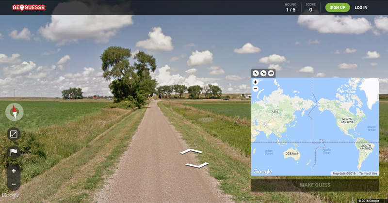

<h2 align="center">GeoGuessr game</h2>

 

## Wymagana wiedza

- JavaScript, HTML, React

## Technologie potrzebne do zadania

- JavaScript, HTML, React

## Cele główne

- [ ] Stwórz grę na wzór GeoGuessr

- [ ] Postaraj się dać użytkownikowi jak najmniej informacji o pozycji w jakiej się znajduje

- Tip. Stwórz tabelę z losowymi koordynatami - takie które są na lądzie gdzie działa street view.

## Zadania dodatkowe

- [ ] Dodaj opcję, że gracz będzie startował w danym regionie (np. Polska, Europa)

- [ ] Dodaj tryb do gry gdzie gracz musi odgadnąć jego pozycje po zdjęciu z street view (tylko zdjęcie - nie może się poruszać).

## Przydatne linki

Gra GeoGuessr - https://www.geoguessr.com/ (musisz się zarejestrować żeby zagrać)

Street view API - https://developers.google.com/maps/documentation/javascript/streetview

