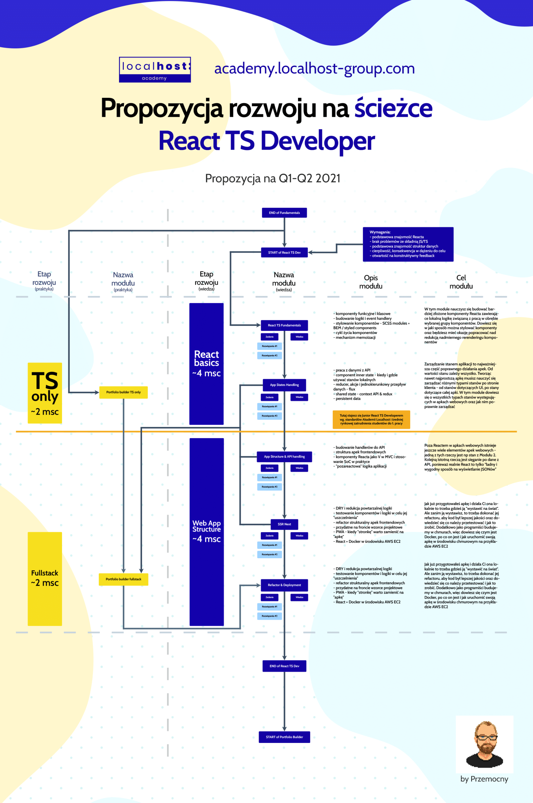

# React TS Roadmap

ostatnia aktualizacja materiałów i zadań - Q2 2021

## 1. Roadmapa

### czyli jak wygląda ścieżka rozwoju w tym miejscu:

## 2. Materiały do nauki:

### Sprawdzona wiedza prosto z Akademii Localhost:

#### Excel z materiałami do nauki

https://docs.google.com/spreadsheets/d/1vreREMx0CxJK1ietXgNkEPzoA0Czfp2ZltmDxdlaQXM/edit#gid=1917774133

#### Autorskie nagrania na tematy teoretyczne i praktyczne można znaleźć tutaj:

- https://gladiators-of-javascript.com/records

## Gotowe środowiska developerskie, które pozwalają zrealizować każde z zadań z tego repozytorium

React + TypeScript - https://create-react-app.dev/docs/adding-typescript/

Next.js + TypeScript - https://github.com/vercel/next.js/tree/canary/examples/with-typescript

## 3. Książki warte przeczytania:

- Typescript na poważnie - Michał Miszczyszyn
- Clean Code - Robert Martin

## 4. Kanały na Youtubie zawierające dużo materiałów o Reactcie i JavaScriptcie:

- https://www.youtube.com/user/99baddawg
- https://www.youtube.com/c/WebDevSimplified
- https://www.youtube.com/c/DevEd

## 5. Portale warte odwiedzenia:

- https://javascript.info/
- https://medium.com/
- https://css-tricks.com/
- https://refactoring.guru/
- https://www.freecodecamp.org/news/best-javascript-tutorial/
- https://frontlive.pl/blog
- https://kentcdodds.com/blog/

#### Aby pozyskiwać wartościowa wiedzę oraz dobrze opisane tutoriale polecam zainwestować w abonament na medium.com - ok $5 / msc - tam jest masa dobrych artykułów i treści
