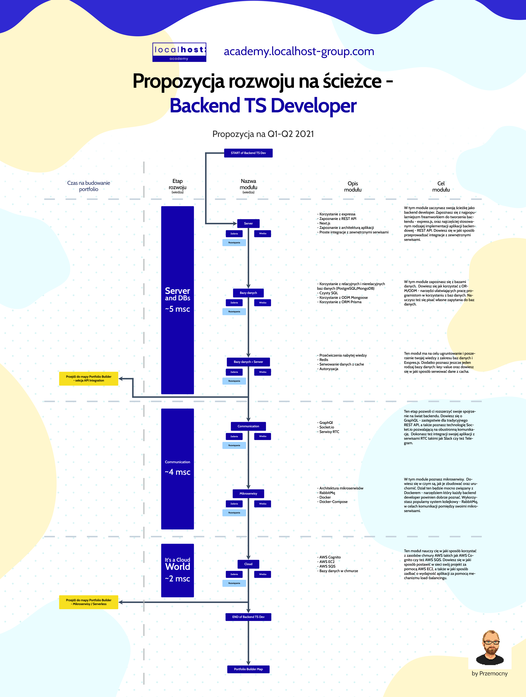

# Backend Express And Next TS
ostatnia aktualizacja materiałów i zadań - Q2 2021

## 1. Roadmapa
### czyli jak wygląda ścieżka rozwoju w tym miejscu:

Roadmapa jest aktualnie aktualizowana. W ciągu dwóch tygodni graficzna interpretacja powinna być dostępna.

### Sprawdzona wiedza prosto z Akademii Localhost:

#### Materiały pisane można znaleźć tutaj:
https://docs.google.com/spreadsheets/d/1z_e13DQhR73MmHdecxT5ppX8u0CAp4O2alFGPZdnYgg/edit?usp=sharing

#### Autorskie nagrania na tematy teoretyczne i praktyczne można znaleźć tutaj:
- https://gladiators-of-javascript.com/records

## Gotowe środowiska developerskie, które pozwalają zrealizować każde z zadań z tego repozytorium

Repozytorium dla JS
https://github.com/Przemocny/js_env_for_training

Repozytorium dla TS
https://github.com/Przemocny/ts_env_for_training

## 2. Książki, które polecam swoim studentom:
- Typescript na poważnie - Michał Miszczyszyn
- Clean Code - Robert Martin

## 3. Portale, które polecam swoim studentom:
- https://javascript.info/
- https://medium.com/
- https://css-tricks.com/
- https://refactoring.guru/
- https://www.freecodecamp.org/news/best-javascript-tutorial/
- https://frontlive.pl/blog

#### Aby pozyskiwać wartościowa wiedzę oraz dobrze opisane tutoriale polecam zainwestować w abonament na medium.com - ok $5 / msc - tam jest masa dobrych artykułów i treści
